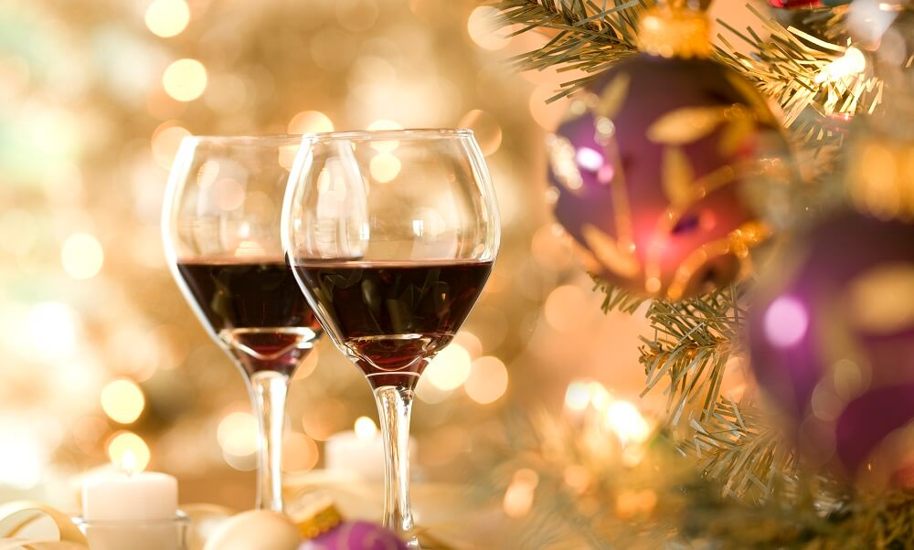

--- 
title: "Vinho Verde Red Wine Quality Analysis"
author: "Sally Bao & Eric Cheng & Qiran Li & Zhibin Li"
date: "`r Sys.Date()`"
site: bookdown::bookdown_site
---

# Introduction

Despite the covid-19 pandemic, we are all looking forward to celebrating Christmas safely with families and friends at home. As lots of people get the festivities started with a great glass of wine, we hope to provide readers with some takeaways on how to pick a wine that matches their taste preference most by analyzing the indicators of the quality of red wine.

In our report, we conduct an exploratory data analysis on the quality of Portugues Vinho Verde red wine. Our goal is to identify the relationship between red wine quality and eleven physicochemical attributes.

In this project, we plan to answer the questions as follows:

- **Does only sweetness or sourness affect the quality of wine the most? If not, which would be the attribute that affects the red wine quality the most?**

- **What's the distribution of each attribute? Are there many outliers in each attribute?**

- **Are there any attribute pairs have a linear correlation? How about multi-linear correlation between quality and the combination of attributes?**

